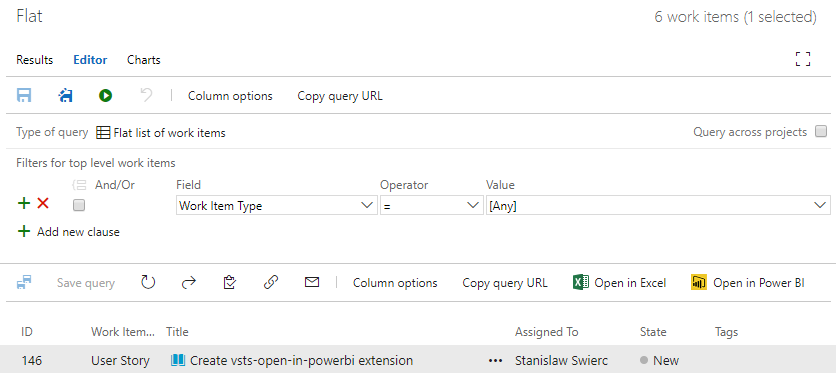

# How to migrate VSTS reports from Excel to Power BI?

> Tags: `Power BI`, `Power Query`, `VSTS`

> Disclaimer: I'm the author of the [Open in Power BI][2] extension.

If you are using Visual Studio Team Services and you want to see the status of the project in a form of reports in Power BI you are probably using great [VSTS Open in Excel][1] extension that was available for years now.
It allows you to load results of your queries into Excel.
It has been very popular among Power BI enthusiasts because of the great integration between Power BI and Excel.

I've talked to many people who setup elaborate data pipelines which pump data from VSTS into Excel and then into Power BI Service so that it can power the reach reports.
The most typical problem with this approach is how to trigger data refresh operation.
Power BI can handle refresh operations provided that you use one of the supported data sources.
Unfortunately, as you can read in the *"VSTS Open in Excel"* extension page it requires *"Visual Studio 2017"* or *"Team Foundation Server Office Integration 2017"* to run.
This makes it impossible to use directly in the Power BI Service.
You can work around this problem by manually refreshing Excel workbook and publishing updated data.
In this post I will briefly describe what [Open in Power BI][2] extension does and how it can help in such scenarios.

Official documentation describes this extension as: 

>Use this extension to create stunning reports in Power BI based on the Work Item Queries saved in Team Services. 
You can **configure your reports to be refreshed** daily to make sure your reports are always up to date.
When you modify your Query by adding extra filters or columns these changes will be automatically reflected in Power BI upon next refresh.

What is particularly interesting is that with this extension you configure data refresh in Power BI Service.
It is possible because it was build on top of *Power Query* functions, which are part of Visual Studio Team Services Power BI Data Connector [\[3\]][3].
These functions are available in the Service and in the Desktop since January 9 2017.
Let's see how we can use it in our scenario.

## Problem statement

Given existing report build on top of [VSTS Open in Excel][1] extension, migrate it to [Open in Power BI][2], publish dataset to Power BI Service and configure refresh.

## Solution

First let's look into how one could build a reporting pipeline on top of [VSTS Open in Excel][1] extension.
As always, it all starts with a WIQL query.
This time it is *"Flat"* query, which is a flat table of work items (I like to be creative with names).

<div class="separator" style="clear: both; text-align: center;">
  <a href="img/wiql.png" imageanchor="1" style="margin-left: 1em; margin-right: 1em;">
    
  </a>
</div>

### Create reports based on "VSTS Open in Excel" extension

I can click "Open in Excel" button and the query result will appear in Excel.
Please notice that columns have the right names and type - neat!

<div class="separator" style="clear: both; text-align: center;"><a href="https://2.bp.blogspot.com/-_trLwUdVvnU/WXQ-YQza85I/AAAAAAABI5w/Tanl_nEJi1AsoSu4DTH-46QniQyUxpIjACPcBGAYYCw/s1600/excel.png" imageanchor="1" style="margin-left: 1em; margin-right: 1em;"></a></div>

I don't need to make any changes here.
I can simply save the spreadsheet locally and switch to Power BI Desktop to import the data.

I can do it by selecting *Get Data* and then *Excel*. 

<div class="separator" style="clear: both; text-align: center;"><a href="https://1.bp.blogspot.com/-d8VNTwBSg6I/WXQ-YlR5KXI/AAAAAAABI5Q/uaRJYE3noLkYggsHO19sFKFFOtvr1R4wgCLcBGAs/s1600/get-data-button.png" imageanchor="1" style="margin-left: 1em; margin-right: 1em;"></a></div>

<div class="separator" style="clear: both; text-align: center;"><a href="https://1.bp.blogspot.com/-ksSNiTG4rWU/WXQ-YYy-Q2I/AAAAAAABI5M/_FlL9lq0-kI9K-Wosidi15QOYpmiihWlACLcBGAs/s1600/get-data.png" imageanchor="1" style="margin-left: 1em; margin-right: 1em;"></a></div>

This will show me all the tables I can import. Please notice that there are **2 tables** I can choose from: *VSTS_e394e0b4...* and *Sheet1*.
It is because when you open a query in Excel the data is imported to a table embedded in a spreadsheet.
You can refer to it in both ways but *VSTS_e394e0b4...* is a **much** better option.
It will not only fetch the data but also **metadata** such as column names and types.
As a result the *Power Query* code will be cleaner.

<div class="separator" style="clear: both; text-align: center;"><a href="https://4.bp.blogspot.com/-54b1vY322AE/WXQ-YBCvsRI/AAAAAAABI5A/-NHV4aIvsOUTQ8J3JL06B8DWMboxQFEvACLcBGAs/s1600/excel-table-selection.png" imageanchor="1" style="margin-left: 1em; margin-right: 1em;"></a></div>

For my query this produced the following result.
Column names were imported correctly, while types had to be set explicitly in code.
This code was automatically generated and it got the types almost right because  `Tags` is set to `type any` instead of `type text`.
This column had no data, thus, Power BI failed to detect its type.
I would need to manually set it to text if I wanted to perform some transformations later.

In order to make this migration more realistic I will customize the query.
One of the popular customization  I've seen in the past is splitting `Area Path` into multiple level columns.
These columns make it easy to create roll-up reports.
I've updated the *Power Query* code accordingly.

```pq
let
    Source = Excel.Workbook(File.Contents("C:\Sources\example.xlsx"), null, true),
    VSTS_e394e0b4_9fbb_4489_b0ea_f38c7103f8bb_Table = Source{[Item="VSTS_e394e0b4_9fbb_4489_b0ea_f38c7103f8bb",Kind="Table"]}[Data],
    #"Changed Type" = Table.TransformColumnTypes(VSTS_e394e0b4_9fbb_4489_b0ea_f38c7103f8bb_Table, {
        {"ID", Int64.Type}, 
        {"Work Item Type", type text}, 
        {"Title", type text}, 
        {"Assigned To", type text}, 
        {"State", type text}, 
        {"Tags", type any}, // Type detection failed for Tags!
        {"Area Path", type text}}),

    // -- Customization -------------------------------------------------------
    #"Split Column by Delimiter" = Table.SplitColumn(#"Changed Type","Area Path",
        Splitter.SplitTextByDelimiter("\", QuoteStyle.Csv),
        {"Area Path.1", "Area Path.2"}),
    #"Changed Type1" = Table.TransformColumnTypes(#"Split Column by Delimiter", {
        {"Area Path.1", type text}, 
        {"Area Path.2", type text}})
in
    #"Changed Type1"
```

After loading the dataset I can publish it to *Power BI Service*, but there are some problems with scheduling refresh as you can see in the screen below.

<div class="separator" style="clear: both; text-align: center;"><a href="https://2.bp.blogspot.com/-SbrveZZ4Rp8/WXQ-YIyaWdI/AAAAAAABI5E/OSlkYUaodvs6fT7Of6PTT86IqzHKI_26ACLcBGAs/s1600/excel-refresh-settings.png" imageanchor="1" style="margin-left: 1em; margin-right: 1em;"></a></div>

First, you need to install *Data Gateway* because *Power BI Service* cannot access path `C:\Sources\example.xlsx`.
It is also worth noticing that the gateway has to run on the same machine where the file is stored and you cannot move the file, otherwise the refresh operation will fail.
Second, if you modify the query and add more columns, then they will not show up in the dataset.
Finally, refresh will only **fetch data that is already present in the spreadsheet**.
This means that unless you manually open *Excel* file and press *Refresh* button in the *Team* toolbar, you will end up with the stale data.

<div class="separator" style="clear: both; text-align: center;"><a href="https://1.bp.blogspot.com/-I9rZAJhtr9w/WXQ-YMdrHgI/AAAAAAABI48/kDy0eIiHTE4gzARhRGXW7pHsx3-1VlFAQCLcBGAs/s1600/excel-refresh-button.png" imageanchor="1" style="margin-left: 1em; margin-right: 1em;"></a></div>

There are some workarounds such a saving workbook to *SharePoint* and scripting refresh operation, but they are more complicated than what an average user could set up.


### Create reports based on "Open in Power BI" extension
Right now we should have a pretty good understanding of how one can use *Excel* to build reports in *Power BI*.
Let's see how to achieve similar result with *Open in Power BI* extension.

Just as before I start with the query result page where I can find *Open in Power BI* button.
This time, instead of opening intermediate app (*Excel*), it will launch *Power BI Desktop* straight away with a dataset ready to refresh.

When I open *Query Editor* I can immediately see some differences.
Probably the biggest one is that there are 2 queries: `Work Items` and `Functions`.
The latter is darker because it is not a table, it is a *Power Query* module that exports functions used in the other queries.

<div class="separator" style="clear: both; text-align: center;"><a href="https://3.bp.blogspot.com/-dq2X9_9w5o4/WXQ-Yp1yKrI/AAAAAAABI5U/pwuw4fhGAIEwgrGaPTyYPu8Ia_gIrAEoQCLcBGAs/s1600/powerbi-queries.png" imageanchor="1" style="margin-left: 1em; margin-right: 1em;"></a></div>

I will ignore `Functions` and look into how I can modify the `Work Items` query to apply the same customization as before.
The query text is shorter and probably looks cleaner.
It is divided into definition of parameters and then `Functions[WiqlRunFlatQueryById]()` is used to fetch a table.
Column names and types are the same and I can use my old code directly.
The only thing that I need to update is the name of the variable that is passed to `Table.SplitColumn` function.
Previously it was `Table.SplitColumn(#"Changed Type"` and now it is `Table.SplitColumn(Source`.
That's it, no other changes!

```pq
let
    url = "https://stansw.visualstudio.com", 
    project = "vsts-open-in-powerbi",
    id = "d5349265-9c9d-4808-933a-c3d27b731657",

    Source = Functions[WiqlRunFlatQueryById](url, [Project = project], id),

    // -- Customization -------------------------------------------------------
    #"Split Column by Delimiter" = Table.SplitColumn(Source,"Area Path",
        Splitter.SplitTextByDelimiter("\", QuoteStyle.Csv),
        {"Area Path.1", "Area Path.2"}),
    #"Changed Type1" = Table.TransformColumnTypes(#"Split Column by Delimiter", {
        {"Area Path.1", type text}, 
        {"Area Path.2", type text}})
in
    #"Changed Type1"

```

Now I can publish dataset to *Power BI Service* and inspect the settings page.
First thing that I can notice is in the *Gateway connection* - *Connect directly* is the only available option.
I do not need to install anything on my machine to get the refresh going!

Section *Data source credentials* is equally interesting.
There is one entry *Visual Studio Team Services*.
Because *Open in Power BI* extension is built on top of functions from the offial *Data Connector*, I can use standard authentication mechanism
[\[3\]][3].

<div class="separator" style="clear: both; text-align: center;"><a href="https://1.bp.blogspot.com/-aq9CY5qtmS0/WXQ-Y1EmUGI/AAAAAAABI5Y/cZbdwZqKBtU1KY6tM0TRFp8KQSFxS65aACLcBGAs/s1600/powerbi-refresh-settings.png" imageanchor="1" style="margin-left: 1em; margin-right: 1em;"></a></div>

Finally I can expand *Scheduled refresh* section and define how often I want my dataset to be refreshed.

## Conclusions
*Open in Power BI* extension was created with *Power BI* scenarios in mind, thus, it is much easier to use than building pipeline with *VSTS Open in Excel*. 
At the end of the day both solutions give me a table so any customization I create in *Power Query* for one solution, I will be able to easily move to another.
The strongest advantage of *Open in Power BI* approach is that it works strainght away in *Power BI Service* without the gateway. 

## References:
1. [Visual Studio Team Services Marketplace - VSTS Open in Excel][1]
2. [Visual Studio Team Services Marketplace - Open in Power BI][2]
3. [Visual Studio Team Services - Functions available in Power BI Data Connector][3]

[1]: https://marketplace.visualstudio.com/items?itemName=blueprint.vsts-open-work-items-in-excel
[2]: https://marketplace.visualstudio.com/items?itemName=stansw.vsts-open-in-powerbi
[3]: https://www.visualstudio.com/en-us/docs/report/powerbi/data-connector-functions#vstscontents
