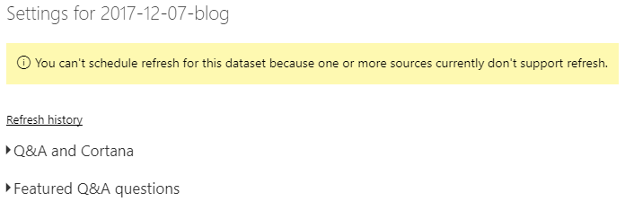
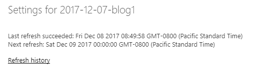

# How to create dynamic OData query in Power BI?
Power BI allows you to import data from any service that exposes OData endpoint. You can either select "*OData feed*" in the "Get Data" window or go directly to *Power Query* editor and use [`OData.Feed`][1] function. Although documentation doesn't explain it clearly this function can operate in two different modes. You can pass either URL to the feed or complete OData query. The latter option is particularly interesting as it allows us to build dynamic queries, however, there is a price!

Let's start with a simple example that loads work items from Visual Studio Team Services using recently announced OData endpoint [[2][2]]. In the example I load all the work items that have been created in the last 7 days. Please notice that I use `DateTimeZone.UtcNow` function to get current date, subtract 7 days and convert it to the *ISO 8601* format.

```pq
let
    since = DateTimeZone.UtcNow() - #duration(7, 0, 0, 0),
    Source = OData.Feed("https://stansw.analytics.visualstudio.com/_odata/WorkItems?" 
        & "$filter=CreatedDate lt " & DateTimeZone.ToText(since, "yyyy-MM-ddThh:mm:ssZ")
        & "&$select=WorkItemId, Title"),
    #"Removed Other Columns" = Table.SelectColumns(Source,{"WorkItemId", "Title"})
in
    #"Removed Other Columns"
```

This code will work great in Power BI Desktop, but when you publish it, you won't be able to schedule refresh, which defeats the purpose of publishing. Why would you share stale data?



The problem is with string concatenation. Power BI refuses to detect host for dynamic URL, thus, it cannot figure out which credentials should be applied to the dataset.

In order to fix it we need to switch to the other mode and use feed. This might not work for an arbitrarily complex OData query, but it should be sufficient for the majority of real-world queries.

This solution boils down to starting with feed and relying on Power Query feature called "*folding*" to translate function calls to the operations natively supported by the data source. In our case we are interested in functions `Table.SelectRows` and `Table.SelectColumns` which can be *folded*. Please notice that not every function can be folded! A good example is `DateTimeZone.UtcNow` which has to be called upfront and only its result can be passed to the filtering expression.

```pq
let
    since = DateTimeZone.UtcNow() - #duration(7, 0, 0, 0),
    Source = OData.Feed("https://stansw.analytics.visualstudio.com/_odata"),
    WorkItems_table = Source{[Name="WorkItems", Signature="table"]}[Data],
    #"Filter Rows" = Table.SelectRows(WorkItems_table, each [CreatedDate] < since),
    #"Select Columns" = Table.SelectColumns(#"Filter Rows",{"WorkItemId", "Title"})
in
    #"Select Columns"
```

During execution, this code will be translated to the following OData query, which is exactly what we wanted.

```odata
https://stansw.analytics.visualstudio.com/_odata/WorkItems?
  $filter=CreatedDate lt 2017-12-01T15:54:56.8747859Z
  &$select=WorkItemId,Title
```

If you publish the dataset to Power BI, the data source will be correctly detected and after you specify credentials you will be able to refresh the data and define a schedule.



I showed how to apply this solution to Visual Studio Team Services feed. It is, however, general and will for your feeds as well.

## References
1. [Power Query M function reference - OData.Feed][1]
2. [VSTS Analytics OData now publicly available][2]
3. [Date and time format - ISO 8601][3]

[1]: https://msdn.microsoft.com/en-us/library/mt260868.aspx
[2]: https://blogs.msdn.microsoft.com/devops/2017/11/22/vsts-analytics-odata-now-publicly-available/
[3]: https://www.iso.org/iso-8601-date-and-time-format.html
